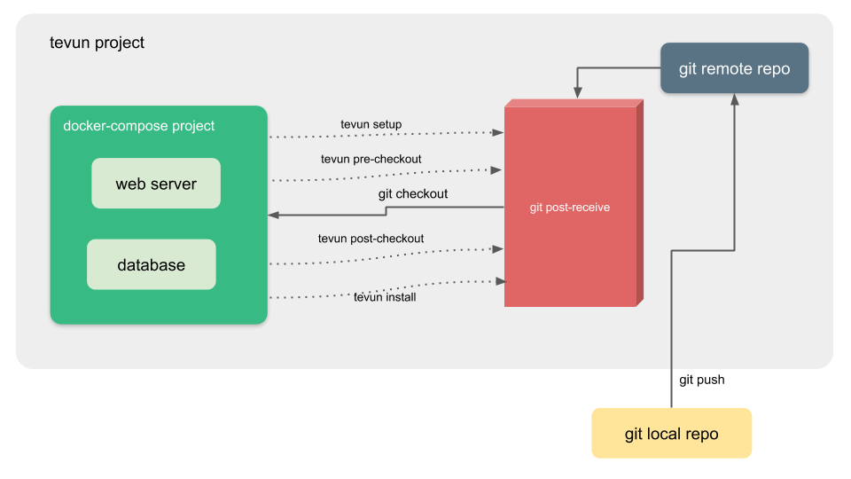

# How it works

## 1. Glossary

### 1.1. Docker

Docker is a computer program that performs operating-system-level virtualization. With `docker` we can run services in the same kernel as containers.

### 1.2. Docker Compose

Compose is a tool for defining and running multi-container Docker applications. Using `docker-compose` it is possible describe the services in an YAML file and Compose will manage the containers.

### 1.3. Git

Git is a distributed version-control system for tracking changes in source code during software development. It will be used to handle the base code and make the new changes available.

### 1.4. Git Hooks

Git hooks are scripts that Git executes before or after events such as: commit, push, and receive. Git hooks are a built-in feature - no need to download anything. Git hooks are run locally. In Tevun we configure the post receive-hook when you create a new project to receive push and deploy the code, but git has others hooks that can be useful to other routines.

## 2. Tevun new project

A new project in Tevun create a docker-compose project sample that need to be extended without lose some principles.

## 3. Tevun project logistic

When we create a Tevun project is created behind the new project a small logistic to handle with the code base.

